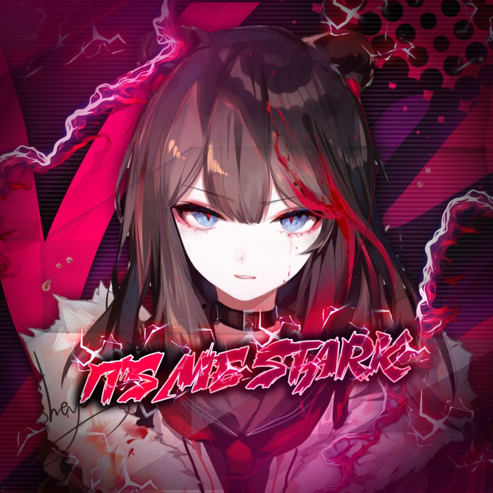

<div align="center">

## [](https://git.io/typing-svg)

 </a>
</p>
<div align="center">
  
  <p align="center">
<a href="#"></a>
</p>
  <p align="center">
<a href="https://github.com/Starkbot90"></a>
</p>
</div>
<p align="center">
Project created by <a href="https://github.com/Starkbot90">Starkbot90</a> to make it public
    <br>
       | © |
        Reserved |
    <br> 
</p>

## Setup
<div align="center">

  ### Simple Method
  
[](https://replit.com/@PrinceRudh/Rudhra-QR)

[](https://heroku.com/deploy?template=https://github.com/Starkbot90/Stark)
     </div>
<br>
If Repl.it not working Try Termux for Qr scanning.Just Copy the Link Below in Termux
```
bash <(curl -L https://t.ly/tHxh)
``` 
  ### If there is an error deploying, try the following steps
  
1. If you dont have a github account create a account. Click [GIT HUB SIGN UP](https://github.com/signup/)

2. Open the WhatsApp account where you want to create the bot and go into the link device and SCAN the QR code Click [SCAN](https://replit.com/@PrinceRudh/Rudhra-QR?v=1)
 
3. If You don't have a account in [Heroku](https://signup.heroku.com/), Create a account.

4. You will have to fork this git to deploy via Heroku.
  click to fork the git into your account
 Click [FORK](https://github.com/Starkbot90/Stark/fork)

5. Now https://heroku.com/deploy?template=https://github.com/Starkbot90/Stark copy this url and change Starkbot90 with your github username and click go<br>

----

<h3 align="center">Contact Me:</h3>
<p align="center">
<a href="https://instagram.com/princerudh" target="blank"></a>
</p>
<h4 align="center">Support Video For Deploy Bot 👇:</h4>
<p align="center">
<a href="https://youtube.com/c/PrinceRudh" target="blank"></a>
</p>

  <p align="center">
  <a href="httsp://github.com/Starkbot90/Stark">
    
<p align="center">
<a href="https://github.com/Starkbot90/followers"></a>
<a href="https://github.com/Starkbot90/Stark/stargazers/"></a>
<a href="https://github.com/Starkbot90/Stark/network/members"></a>
<a href="https://github.com/Starkbot90/Stark/watchers"></a>
<a href="#">
</p>

## 📢 Guide
Click WA logo to Join Support Group 👇
    <br>
<br>
  [](https://chat.whatsapp.com/HVpTaTICeUi2G7hPlUlGUP)
  <div align="center">
       
  </div>
  
### The Hard Method
```js
GET QR
$ apt update
$ apt install nodejs --fix-missing
$ pkg install git
$ git clone https://github.com/Starkbot90/Stark
$ cd Rudhra
$ chmod +x *
$ npm install @adiwajshing/baileys
$ npm install chalk
$ node qr.js
```
      
```js
SETUP
$ git clone https://github.com/Starkbot90/Stark
$ cd Rudhra
$ chmod +x *
$ npm i
$ node qr.js
   // scan the qr using whatsapp web on your phone
$ node bot.js
```


### ⚠️ Warning! 
```
Due to Userbot; Your WhatsApp account may be banned.
This is an open source project, you are responsible for everything you do. 
Absolutely, Asena executives do not accept responsibility.
By establishing the Asena, you are deemed to have accepted these responsibilities.
```

## Developer
  <div align="center">
    
  [](https://github.com/Starkbot90)

[`Starkbot90`](https://github.com/Starkbot90)  
Base, Bug Fixed Modifiying  as   public | Bug Fixes, Modules
  </div>
    


## License
This project is protected by `GNU General Public Licence v3.0` license.

### Disclaimer
`WhatsApp` name, its variations and the logo are registered trademarks of Facebook. We have nothing to do with the registered trademark

